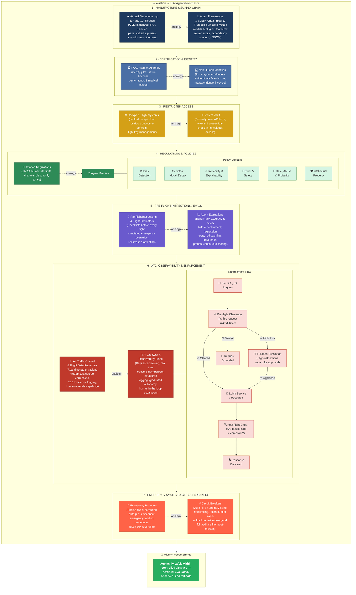
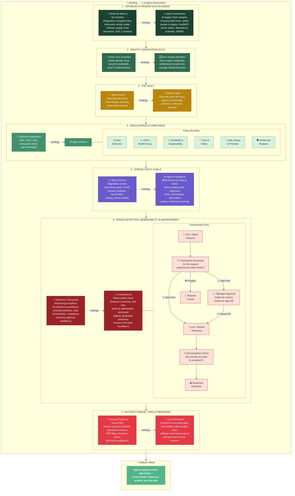

```mermaid
flowchart TB
    subgraph FRAMEWORK["✈️ Aviation → 🤖 AI Agent Governance"]
        direction TB

        subgraph BUILD["1 · MANUFACTURE & SUPPLY CHAIN"]
            direction LR
            PLANE["✈️ Aircraft Manufacturing</br>& Parts Certification</br>(OEM standards, FAA-certified</br>parts, vetted suppliers,</br>airworthiness directives)"]
            AGENT["🤖 Agent Frameworks</br>& Supply Chain Integrity</br>(Purpose-built tools, vetted</br>models & plugins, tool/MCP</br>server audits, dependency</br>scanning, SBOM)"]
            PLANE -. "analogy" .-> AGENT
        end

        subgraph CREDENTIALS["2 · CERTIFICATION & IDENTITY"]
            direction LR
            FAA["🏛️ FAA / Aviation Authority</br>(Certify pilots, issue licenses,</br>verify ratings & medical fitness)"]
            NHI["🆔 Non-Human Identities</br>(Issue agent credentials,</br>authenticate & authorize,</br>manage identity lifecycle)"]
            FAA -. "analogy" .-> NHI
        end

        subgraph SECRETS["3 · RESTRICTED ACCESS"]
            direction LR
            COCKPIT["🔒 Cockpit & Flight Systems</br>(Locked cockpit door,</br>restricted access to controls,</br>flight key management)"]
            VAULT["🔐 Secrets Vault</br>(Securely store API keys,</br>tokens & credentials;</br>check-in / check-out access)"]
            COCKPIT -. "analogy" .-> VAULT
        end

        subgraph POLICY["4 · REGULATIONS & POLICIES"]
            direction LR
            REGS["📜 Aviation Regulations</br>(FAR/AIM, altitude limits,</br>airspace rules, no-fly zones)"]
            POLICIES["📋 Agent Policies"]
            REGS -. "analogy" .-> POLICIES

            subgraph CONCERNS["Policy Domains"]
                direction TB
                BIAS["⚖️ Bias</br>Detection"]
                DRIFT["📉 Drift &</br>Model Decay"]
                RELIABLE["✅ Reliability &</br>Explainability"]
                TRUST["🤝 Trust &</br>Safety"]
                HAP["🚫 Hate, Abuse</br>& Profanity"]
                IP["🛡️ Intellectual</br>Property"]
            end
            POLICIES --- CONCERNS
        end

        subgraph EVALS["5 · PRE-FLIGHT INSPECTIONS / EVALS"]
            direction LR
            PREFLIGHT["🔧 Pre-flight Inspections</br>& Flight Simulators</br>(Checklists before every flight,</br>simulated emergency scenarios,</br>recurrent pilot testing)"]
            AGENTEVAL["📊 Agent Evaluations</br>(Benchmark accuracy & safety</br>before deployment; regression</br>tests, red-teaming, adversarial</br>probes, continuous scoring)"]
            PREFLIGHT -. "analogy" .-> AGENTEVAL
        end

        subgraph ENFORCE["6 · ATC, OBSERVABILITY & ENFORCEMENT"]
            direction LR
            ATC["🗼 Air Traffic Control</br>& Flight Data Recorders</br>(Real-time radar tracking,</br>clearances, course corrections,</br>FDR black-box logging,</br>human override capability)"]
            GATEWAY["🚧 AI Gateway &</br>Observability Plane</br>(Request screening, real-time</br>traces & dashboards, structured</br>logging, graduated autonomy,</br>human-in-the-loop escalation)"]
            ATC -. "analogy" .-> GATEWAY

            subgraph FLOW["Enforcement Flow"]
                direction TB
                PILOT["👤 User / Agent</br>Request"]
                CLEARANCE["🔍 Pre-flight Clearance</br>(Is this request</br>authorized?)"]
                AIRSPACE["🧠 LLM / Service</br>/ Resource"]
                DEBRIEF["🔍 Post-flight Check</br>(Are results safe</br>& compliant?)"]
                LANDING["📤 Response</br>Delivered"]
                HITL["👨‍✈️ Human Escalation</br>(High-risk actions</br>routed for approval)"]

                PILOT --> CLEARANCE
                CLEARANCE -- "✅ Cleared" --> AIRSPACE
                CLEARANCE -- "⚠️ High Risk" --> HITL
                HITL -- "✅ Approved" --> AIRSPACE
                CLEARANCE -- "❌ Denied" --> GROUNDED["🚫 Request</br>Grounded"]
                AIRSPACE --> DEBRIEF
                DEBRIEF --> LANDING
            end
            GATEWAY --- FLOW
        end

        subgraph CIRCUIT["7 · EMERGENCY SYSTEMS / CIRCUIT BREAKERS"]
            direction LR
            EMERGENCY["🚨 Emergency Protocols</br>(Engine fire suppression,</br>auto-pilot disconnect,</br>emergency landing procedures,</br>black-box recording)"]
            BREAKER["⚡ Circuit Breakers</br>(Auto-kill on anomaly spike,</br>rate limiting, token budget caps,</br>rollback to last known good,</br>full audit trail for post-mortem)"]
            EMERGENCY -. "analogy" .-> BREAKER
        end

        BUILD --> CREDENTIALS
        CREDENTIALS --> SECRETS
        SECRETS --> POLICY
        POLICY --> EVALS
        EVALS --> ENFORCE
        ENFORCE --> CIRCUIT
    end

    subgraph GOAL["🎯 Mission Accomplished"]
        SAFE["Agents fly safely within controlled airspace —</br>certified, evaluated, observed, and fail-safe"]
    end

    CIRCUIT --> GOAL

    classDef buildStyle fill:#1E3A5F,stroke:#0D1F33,color:#fff
    classDef credStyle fill:#4A6FA5,stroke:#2C4A7A,color:#fff
    classDef secretStyle fill:#D4A017,stroke:#9B7B0E,color:#fff
    classDef policyStyle fill:#2E8B57,stroke:#1A5E3A,color:#fff
    classDef evalStyle fill:#6A5ACD,stroke:#483D8B,color:#fff
    classDef enforceStyle fill:#C0392B,stroke:#8B1A1A,color:#fff
    classDef circuitStyle fill:#FF6347,stroke:#CC3A1F,color:#fff
    classDef goalStyle fill:#27AE60,stroke:#1A7A42,color:#fff,font-weight:bold
    classDef concernStyle fill:#D5F5E3,stroke:#2E8B57,color:#333
    classDef flowStyle fill:#FADBD8,stroke:#C0392B,color:#333

    class PLANE,AGENT buildStyle
    class FAA,NHI credStyle
    class COCKPIT,VAULT secretStyle
    class REGS,POLICIES policyStyle
    class PREFLIGHT,AGENTEVAL evalStyle
    class ATC,GATEWAY enforceStyle
    class EMERGENCY,BREAKER circuitStyle
    class SAFE goalStyle
    class BIAS,DRIFT,RELIABLE,TRUST,HAP,IP concernStyle
    class PILOT,CLEARANCE,AIRSPACE,DEBRIEF,LANDING,GROUNDED,HITL flowStyle
```

---
title: "AI Agent Security: The Banking Analogy"
---

```mermaid
flowchart TB
    subgraph FRAMEWORK["🏦 Banking → 🤖 AI Agent Governance"]
        direction TB

        subgraph BUILD["1 · ESTABLISH & VENDOR DUE DILIGENCE"]
            direction LR
            BANK["🏦 Build the Bank &</br>Vet Vendors</br>(Regulatory-compliant infra,</br>third-party vendor audits,</br>software supply chain</br>assurance, SOC 2 reviews)"]
            AGENT["🤖 Agent Frameworks</br>& Supply Chain Integrity</br>(Purpose-built tools, vetted</br>models & plugins, tool/MCP</br>server audits, dependency</br>scanning, SBOM)"]
            BANK -. "analogy" .-> AGENT
        end

        subgraph CREDENTIALS["2 · IDENTITY VERIFICATION (KYC)"]
            direction LR
            KYC["🪪 Know Your Customer</br>(Verify identity, issue</br>account credentials,</br>proof of authorization)"]
            NHI["🆔 Non-Human Identities</br>(Issue agent credentials,</br>authenticate & authorize,</br>manage identity lifecycle)"]
            KYC -. "analogy" .-> NHI
        end

        subgraph SECRETS["3 · THE VAULT"]
            direction LR
            SAFEBOX["🏧 Bank Vault &</br>Safe Deposit Boxes</br>(Time-locked, dual-key,</br>audit-trailed access)"]
            VAULT["🔐 Secrets Vault</br>(Securely store API keys,</br>tokens & credentials;</br>check-in / check-out access)"]
            SAFEBOX -. "analogy" .-> VAULT
        end

        subgraph POLICY["4 · REGULATIONS & COMPLIANCE"]
            direction LR
            REGS["📜 Financial Regulations</br>(SEC, FDIC, AML,</br>transaction limits,</br>risk thresholds)"]
            POLICIES["📋 Agent Policies"]
            REGS -. "analogy" .-> POLICIES

            subgraph CONCERNS["Policy Domains"]
                direction TB
                BIAS["⚖️ Bias</br>Detection"]
                DRIFT["📉 Drift &</br>Model Decay"]
                RELIABLE["✅ Reliability &</br>Explainability"]
                TRUST["🤝 Trust &</br>Safety"]
                HAP["🚫 Hate, Abuse</br>& Profanity"]
                IP["🛡️ Intellectual</br>Property"]
            end
            POLICIES --- CONCERNS
        end

        subgraph EVALS["5 · STRESS TESTS / EVALS"]
            direction LR
            STRESS["📈 Stress Tests &</br>Regulatory Exams</br>(Fed stress tests, CCAR,</br>scenario analysis, penetration</br>testing, annual audits)"]
            AGENTEVAL["📊 Agent Evaluations</br>(Benchmark accuracy & safety</br>before deployment; regression</br>tests, red-teaming, adversarial</br>probes, continuous scoring)"]
            STRESS -. "analogy" .-> AGENTEVAL
        end

        subgraph ENFORCE["6 · FRAUD DETECTION, OBSERVABILITY & ENFORCEMENT"]
            direction LR
            AUDIT["🔎 Real-time Transaction</br>Monitoring & Auditors</br>(Continuous surveillance,</br>anomaly detection, daily</br>reconciliation, compliance</br>reporting, approval workflows)"]
            GATEWAY["🚧 AI Gateway &</br>Observability Plane</br>(Request screening, real-time</br>traces & dashboards, structured</br>logging, graduated autonomy,</br>human-in-the-loop escalation)"]
            AUDIT -. "analogy" .-> GATEWAY

            subgraph FLOW["Enforcement Flow"]
                direction TB
                CUSTOMER["👤 User / Agent</br>Request"]
                TELLER["🔍 Transaction Screening</br>(Is this request</br>authorized & within limits?)"]
                LEDGER["🧠 LLM / Service</br>/ Resource"]
                RECONCILE["🔍 Reconciliation Check</br>(Are results accurate</br>& compliant?)"]
                RECEIPT["📤 Response</br>Delivered"]
                HITL["👨‍💼 Manager Approval</br>(High-risk actions</br>routed for sign-off)"]

                CUSTOMER --> TELLER
                TELLER -- "✅ Approved" --> LEDGER
                TELLER -- "⚠️ High Risk" --> HITL
                HITL -- "✅ Signed Off" --> LEDGER
                TELLER -- "❌ Flagged" --> FROZEN["🚫 Request</br>Frozen"]
                LEDGER --> RECONCILE
                RECONCILE --> RECEIPT
            end
            GATEWAY --- FLOW
        end

        subgraph CIRCUIT["7 · ACCOUNT FREEZE / CIRCUIT BREAKERS"]
            direction LR
            FREEZE["🧊 Account Freeze &</br>Fraud Hold</br>(Instant account lockdown,</br>transaction reversal,</br>SAR filing, insurance claims,</br>forensic investigation)"]
            BREAKER["⚡ Circuit Breakers</br>(Auto-kill on anomaly spike,</br>rate limiting, token budget caps,</br>rollback to last known good,</br>full audit trail for post-mortem)"]
            FREEZE -. "analogy" .-> BREAKER
        end

        BUILD --> CREDENTIALS
        CREDENTIALS --> SECRETS
        SECRETS --> POLICY
        POLICY --> EVALS
        EVALS --> ENFORCE
        ENFORCE --> CIRCUIT
    end

    subgraph GOAL["🎯 Balance Sheet"]
        SAFE["Agents operate within safe limits —</br>stress-tested, observed, audited, and fail-safe"]
    end

    CIRCUIT --> GOAL

    classDef buildStyle fill:#1B4332,stroke:#0D2818,color:#fff
    classDef credStyle fill:#2D6A4F,stroke:#1B4332,color:#fff
    classDef secretStyle fill:#B8860B,stroke:#8B6508,color:#fff
    classDef policyStyle fill:#40916C,stroke:#2D6A4F,color:#fff
    classDef evalStyle fill:#6A5ACD,stroke:#483D8B,color:#fff
    classDef enforceStyle fill:#9B2226,stroke:#6B1518,color:#fff
    classDef circuitStyle fill:#E63946,stroke:#B02D38,color:#fff
    classDef goalStyle fill:#52B788,stroke:#40916C,color:#fff,font-weight:bold
    classDef concernStyle fill:#D8F3DC,stroke:#40916C,color:#333
    classDef flowStyle fill:#FFE0D6,stroke:#9B2226,color:#333

    class BANK,AGENT buildStyle
    class KYC,NHI credStyle
    class SAFEBOX,VAULT secretStyle
    class REGS,POLICIES policyStyle
    class STRESS,AGENTEVAL evalStyle
    class AUDIT,GATEWAY enforceStyle
    class FREEZE,BREAKER circuitStyle
    class SAFE goalStyle
    class BIAS,DRIFT,RELIABLE,TRUST,HAP,IP concernStyle
    class CUSTOMER,TELLER,LEDGER,RECONCILE,RECEIPT,FROZEN,HITL flowStyle
```
